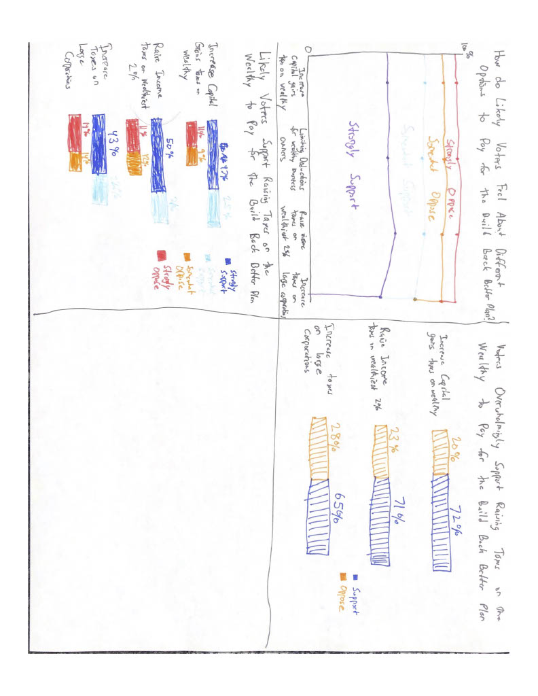

## Assignments 3 and 4

[Original Visualization](https://cdn.vox-cdn.com/thumbor/RQkaO8CmEUiS2-4RHous9GhUdvk=/0x0:1716x1502/1320x0/filters:focal(0x0:1716x1502):format(webp):no_upscale()/cdn.vox-cdn.com/uploads/chorus_asset/file/22926396/image__21_.png)

[Source Article](https://www.vox.com/2021/10/15/22723457/build-back-better-poll-democrats-bill-infrastructure-taxes)

### Step one - Finding a Visualization

I selected this particular visualization for a few reasons. First, I am interested in the subject and it is quite relevant given the recent passage of the infrastructure bill. Second, I felt that this visualization was quite strong overall, but could be improved with some minor tweaks. The color scheme looks clean and the message of the visualization is clear. However, I also noticed large amounts of text which we recently discussed in class as a sign that the graph may not be conveying its message as clearly as it could be. I also felt that the "support", "oppose", and "net" sections were a bit awkward and out of place. Finally, I felt there was room to simplify the visualization while still conveying the main idea.

### Step Two - Critique

For my critique, I tried to take note of my initial impressions and examine how those impressions fit into the Stephen Few critique framework. My overall initial impression was quite positive. I felt that the message communicated was clear and the legend and axes relatively easy to understand. However, I felt there were some visual cues that could be improved and that the layout could be simplified while still retaining the overall theme. For example, the red-blue color scheme instinctually caused me to assume these shadings represented political party affiliation. This is likely because the article mentioned Democrat and Republican support both immediately preceding, and immediately after this visualization. Moreover, the other visualization in the article used a similar color scheme, but this scheme actually did represent party affiliation. My remaining critiques centered around the clarity of the visualization. I felt that there was too much text on the page and too much color. As I thought about it further, I realized that the "support", "oppose" and "net" sections of the visualization were actually the most important. These sections clearly expressed the wide margins by which likely voters supported taxation of the wealthy and large corporations to pay for the Build Back Better Plan. Paradoxically, I felt that this section was actually de-emphasized, with the focus being on the shaded bars. Thus, I knew that in my wireframing and final visualization, I would want to emphasize this part of the data rather than each specific survey response.

### Step Three - Wireframing

When I was wireframing, I initially thought about completely re-visualizing the way this information was displayed. I began creating an area chart, in the hopes of more strongly visually emphasizing the overwhelming support for taxing the wealthy to pay for the infrastructure bill. Unfortunately, the area chart seemed to be a poor fit for this type of data. The lines erroneously suggested that there was some sort of time element involved, even though there is no passage of time with this data. I then moved back towards the format of the original visualization, but focused on stripping away excess text and color to simplify the visual while maintaining the clarity of the message. In my second sketch (bottom left), I found that the amount of color was still distracting and the overall message wasn't immediately discernible. I then moved to a third iteration in the top right, where I settled on only including shading for support or opposition to each measure. I also removed two of the survey questions that seemed less directly related to taxation of the wealthy and corporations. 

### Step Four - Feedback

I spoke with two friends to gather feedback, one of whom had taken the course before. The main takeaway from gathering feedback was that both individuals preferred the simplest visual I created during my wireframing. They seemed to be more confused by my first sketch than they probably would have been from the original visualization, so that seemed to be a step in the wrong direction. They preferred the bar chart format for expressing survey responses. However, I may have stripped away too much detail from the original graph, thereby introducing more confusion in my attempts to simplify the visualization and its message. Interestingly, one of the respondents preferred a title for the visualization that did not state the main idea, but instead asked a question. They felt that the question made them curious, and forced them to interact with the visualization to find the desired conclusion rather than simply being told that detail up front. I'm not sure I agree with that sentiment, but it does raise questions about the trade-off between clearly stating the take-away and user interaction with the visualization. Detailed Responses included below:

#### Respondent 1

**What do you think these visualizations are trying to say?**

"The visualizations are trying to compare the popularity of different methods to pay for the infrastructure bill (and I will admit I got that from the titles!). I think the argument the visualizations are making are that policies targeting the wealthy are more popular with the American public than one would ordinarily believe -- at least half support broad measures to get the wealthy to pay for public goods."

**Where did you look first? Is there any visualization in particular that you were drawn to initially?**

"I will admit I was drawn to the first one (the stacked area graph) because I wasn't totally sure what it was trying to convey -- I thought it was a line graph and spent a while trying to decipher the trend. The one directly below it is what caught my eye next because of the varied colors -- it's hard not to be drawn to things that are particularly bright!"

**Which visualization do you feel most clearly communicates the main idea?**

"The third (?) one on the top right -- I think it clearly emphasizes the popularity of the policies at hand and cuts out a lot of the unnecessary detail that can clutter the visualization when you retail the full scale. Part of its efficacy is the simplification of the colors: while the second one conveys more information, there's a lot going on and it can be hard to figure out where to focus. It's very clean, easy to read, and does not leave any ambiguity about the point you're trying to make."

**Is there anything you find surprising or confusing?**

"I already mentioned that I thought the stacked area graph was a line graph -- I also don't think I did a great job at discerning the meeting because the support for each policy was so consistent, I didn't totally get what I was supposed to be looking for. Regarding the actual information, I'm shocked there isn't more support for these policies, and I was particularly shocked that taxing large corporations was the least popular of the three. Bizarre."

**Who do you think is the intended audience for this?**

"Probably policymakers -- I can see this being an effective tool for arguing that these should be the steps taken because they're popular with constituents. It conveys the information quickly as well, which is perfect for someone who only has 2 seconds in total to look at your work."

**Is there anything you would change or do differently?**

"Two things: (1) Maybe change up some of the colors! Gray is a very effective grounding color, and might work better when trying to contrast what you want us to focus on (the level of support) from the other junk (opposition). Also I know you all talk about how pie charts are terrible in class, but sometimes they help! We could also try something like a vertical bar graph just showing levels of support and cutting opposition out of the picture entirely? (2) Swapping the order so that the largest proportion is closest to the label -- I want to show that there's a lot of support and it's more intuitive to read the chart when the "support" part of the bar is closer to the y-axis."

#### Respondent 2

**What do you think these visualizations are trying to say?**

"The first visualization doesn’t make sense. I interpreted it as 99% that strongly oppose for example. The second one makes a lot more sense...Ohhh I get the first one now. I hate it. I think they are trying to say how certain voters responded with certain positions in relation to these issues." 

**Where did you look first? Is there any visualization in particular that you were drawn to initially?**

"Top left naturally. But that one was the most confusing. So then I went to the top right. I think actually the top right most clearly communicates the idea, although I appreciate the specificity of the bottom left one."

**Which visualization do you feel most clearly communicates the main idea?**

"Combination of the top right and bottom left visualizations might be best. However, they don’t add up to 100% so I’m confused about that. I would appreciate a bar at the bottom to show like “neither” to get to 100%."

**Is there anything you find surprising or confusing?**

"I find the first one extremely confusing. I don’t like that there’s a line in it. I feel like they should be bars and like a bar graph, first part purple, then blue, then red, then orange for example. The lines are very confusing."

**Who do you think is the intended audience for this?**

"Probably other voters. Or like the general public. Would be useful for politicians as well."

**Is there anything you would change or do differently?**

"Where’s the other % - that’s what I want to know! Did they not reply? Did they not fit in? I like the framing of the first question better than the ones that declare the point. I like the question better than the claim. It encourages the people to actually look at the data and be like “let me answer this question”. I also feel like 'overwhelmingly' is a subjective term."

### Step Five - Final Visualization

After wireframing and gathering feedback, I understood that I wanted to strike a balance between the original visualization, and the sketches I created during wireframing. The original visualization was interesting and visually appealing, but it was also text-heavy, buried its main message somewhat, and used a color scheme that may erroneously suggest to readers that the color scheme represented party affiliation. However, my wireframe sketches may have stripped away too much detail - viewers were confused about how the percentages did not add up to 100. I received similar feedback in class reflecting to see some of the detail from the original visualization that I had removed. Thus, I opted to create a visualization similar to the original (a stacked bar chart), but I altered the color scheme, data presented, and text. First, I utilized only the "Support", "oppose" and "don't know" numbers from the original visualization. While this eliminates some insight into the intensity of support and opposition, the overall message is still clear: Voters support taxing the wealthy to pay for the infrastructure bill. After hearing class feedback, I opted to include percentages within each bar - this provides some specificity that users may desire, rather than being forced to compare the size of the "support" and "oppose" bars. I think that this provides enough detail and obviates the need for a "net" category like the original visualization had. Viewers can easily understand that 65% is much larger than 28% without needing to know that the difference between the two is 37%. Finally, based on class feedback, I increased the size and bolded each of the bar labels so that viewers can easily discern what question is being answered. 

[Back to Main Portfolio](Harkins-Portfolio.md)

